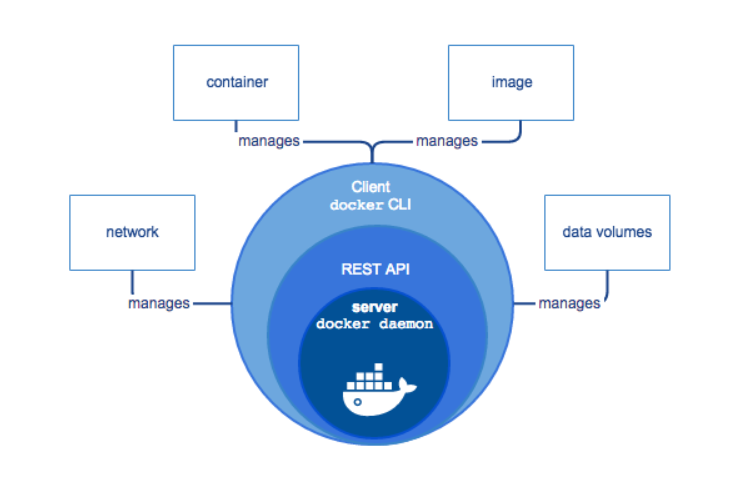

# 1. Docker là gì? 
- Docker là một nền tảng cho developers và sysadmin để develop, deploy và run application với container. Nó cho phép tạo ra các môi trường dộc lập để khởi chạy và phét triển ứng dụng và môi trường này được gọi là container. Khi cần deploy lên bất kỳ server nào chỉ cần run container của Docker thì application của bạn sẽ được khởi chạy ngay lập tức
- Các containers cho phép lập trình viên đóng gói một ứng dụng với tất cả các phần cần thiết, chẳng hạn như thư viện và các phụ thuộc khác, và gói tất cả ra dưới dạng một package.
# 2. Lợi ích của docker
- Thời gian “start” và “stop” cực ngắn
- Tính đóng gói và di động: Tất cả các gói dependencies cần thiết đều được đóng gói vừa đủ trong container. Và sau đó có thể mang đi triển khai trên các server khác.
- Cô lập tài nguyên: server không biết ở trong container chạy gì và container cũng không cần biết là CentOs hay Ubuntu. Các container độc lập với nhau và có thể giao tiếp với nhau bằng một interface
- Hỗ trợ phát triển và quản lý ứng dụng nhanh: Đối với Dev, sử dụng docker giúp họ giảm thiểu thời gian setup môi trường, đóng gói được các môi trường giống nhau từ Dev - Staging - Production :v
- Nó giữ cho word-space sạch sẽ hơn khi xóa môi trường mà ảnh hưởng đến các phần khác.
- Mã nguồn mở: Cộng đồng support lớn, các tính năng mới được release liên tục.
# 3. Docker Engine
- Docker Engine là một ứng dụng client-server. Có hai phiên bản Docker Engine phổ biến là:

  - Docker Community Edition (CE): Là phiên bản miễn phí và chủ yếu dựa vào các sản phầm nguồn mở khác. Cũng sẽ là phiên bản mình sử dụng trong suốt serie này.

  - Docker Enterprise: Khi sử dụng phiên bản này bạn sẽ nhận được sự support của nhà phát hành, có thêm các tính năng quản lý và security.

- Các thành phần chính của Docker Engine gồm có:

  - Server hay còn được gọi là docker daemon (dockerd): chịu trách nhiệm tạo, quản lý các Docker objects như images, containers, networks, volume.

  - REST API: docker daemon cung cấp các api cho Client sử dụng để thao tác với Docker

  - Client là thành phần đầu cuối cung cấp một tập hợp các câu lệnh sử dụng api để người dùng thao tác với Docker. (Ví dụ docker images, docker ps, docker rmi image v.v..)

 

# 4. Kiến trúc của Docker
 

- Docker sử dụng kiến trúc client-server. Docker server (hay còn gọi là daemon) sẽ chịu trách nhiệm build, run, distrubute Docker container. Docker client và Docker server có thể nằm trên cùng một server hoặc khác server. Chúng giao tiếp với nhau thông qua REST API dựa trên UNIX sockets hoặc network interface.

- **Docker Daemon**
  - Docker daemon (dockerd) là thành phần core, lắng nghe API request và quản lý các Docker object. Docker daemon host này cũng có thể giao tiếp được với Docker daemon ở host khác.
- **Docker client**
  - Docker client (docker) là phương thức chính để người dùng thao tác với Docker. Khi người dùng gõ lệnh docker run imageABC tức là người dùng sử dụng CLI và gửi request đến dockerd thông qua api, và sau đó Docker daemon sẽ xử lý tiếp.

  - Docker client có thể giao tiếp và gửi request đến nhiều Docker daemon.
- **Docker registry**
  - Docker registry là một kho chứa các Image. Images được push vào registry và client sẽ pull images từ registry. Nổi tiếng nhất chính là Docker Hub, ngoài ra bạn có thể tự xây dựng một Docker registry cho riêng mình.
- **Docker object**
  - Các object này chính là các đối tượng mà bạn thường xuyên gặp phải khi sử dụng Docker gồm có: 
    - Images

      - Image là một template read-only sử dụng để chạy container.

      - Một image có thể base trên một image khác. Ví dụ bạn muốn tạo một image nginx, tất nhiên nginx phải chạy trên linux ubuntu chẳng hạn. Khi đó image nginx trước hết sẽ phải base trên ubuntu trước đã.

      - Bạn có thể tự build image cho riêng mình hoặc tải các image có sẵn của người khác trên Docker registry.

    - Container

      - Container được chạy dựa trên 1 image cụ thể. Bạn có thể tạo, start, stop, move, delete container.

      - Bạn cũng có thể kết nối các container với nhau hoặc attach storage cho nó, thậm chí là tạo lại một image từ chính state hiện tại của container

      - Container cô lập tài nguyên với host và các container khác.
# 5. Một số khái niệm khác  

- **Docker Hub** : là một “github for docker images”. Trên DockerHub có hàng ngàn public images được tạo bởi cộng đồng cho phép bạn dễ dàng tìm thấy những image mà bạn cần. Và chỉ cần pull về và sử dụng với một số config mà bạn mong muốn.

- **Volumes**: là phần dữ liệu được tạo ra khi container được khởi tạo.
- **Docker Repository**: là tập hợp các Docker Images cùng tên nhưng khác tags
- **Docker Networking**: cho phép kết nối các container lại với nhau. Kết nối này có thể trên 1 host hoặc nhiều host.
- **Docker Compose**: là công cụ cho phép run app với nhiều Docker containers 1 cách dễ dàng hơn. Docker Compose cho phép bạn config các command trong file docker-compose.yml để sử dụng lại. Có sẵn khi cài Docker.
- **Docker Swarm**: để phối hợp triển khai container.
- **Docker Services**: là các containers trong production. 1 service chỉ run 1 image nhưng nó mã hoá cách thức để run image — sử dụng port nào, bao nhiêu bản sao container run để service có hiệu năng cần thiết và ngay lập tức.

# 6. Dockerfile
- Dockerfile là file config cho Docker để build ra image. 
- Nó dùng một image cơ bản để xây dựng lớp image ban đầu. Một số image cơ bản: python, unbutu and alpine. Sau đó nếu có các lớp bổ sung thì nó được xếp chồng lên lớp cơ bản. Cuối cùng một lớp mỏng có thể được xếp chồng lên nhau trên các lớp khác trước đó.
- Các config :

config | ý nghĩa
---|---
FROM   |  chỉ định image gốc: python, unbutu, alpine…
LABEL | cung cấp metadata cho image. Có thể sử dụng để add thông tin maintainer. Để xem các label của images, dùng lệnh docker inspect.
ENV | thiết lập một biến môi trường.
RUN | Có thể tạo một lệnh khi build image. Được sử dụng để cài đặt các package vào container.
COPY | Sao chép các file và thư mục vào container.
ADD | Sao chép các file và thư mục vào container.
CMD | Cung cấp một lệnh và đối số cho container thực thi. Các tham số có thể được ghi đè và chỉ có một CMD.
WORKDIR | Thiết lập thư mục đang làm việc cho các chỉ thị khác như: RUN, CMD, ENTRYPOINT, COPY, ADD,…
ARG | Định nghĩa giá trị biến được dùng trong lúc build image.
ENTRYPOINT | cung cấp lệnh và đối số cho một container thực thi.
EXPOSE | khai báo port lắng nghe của image.
VOLUME | tạo một điểm gắn thư mục để truy cập và lưu trữ data.

# 7. Quy trình thực thi của một hệ thống sử dụng Docker

 

- Một hệ thống Docker được thực thi với 3 bước chính :

        Build >> Push >> Pull/Run

- **Build**
   - Đầu tiên tạo một dockerfile, trong dockerfile này chính là code của chúng ta.
   - Dockerfile này sẽ được Build tại một máy tính đã cài đặt Docker Engine.
   - Sau khi build ta sẽ có được Container, trong Container này chứa ứng dụng kèm bộ thư viện của chúng ta.
- **Push**
  - Sau khi có được Container, chúng ta thực hiện push Container này lên cloud và lưu tại đó.
- **Pull/Run**
  - Nếu một máy tính khác muốn sử dụng Container chúng ta thì bắt buộc máy phải thực hiện việc Pull container này về máy, tất nhiên máy này cũng phải cài Docker Engine. Sau đó thực hiện Run Container này.

# Tham khảo

- https://topdev.vn/blog/docker-la-gi/

- https://dev.classmethod.jp/articles/docker-la-gi-tim-hieu-mot-so-dinh-nghia-co-ban-ve-docker/