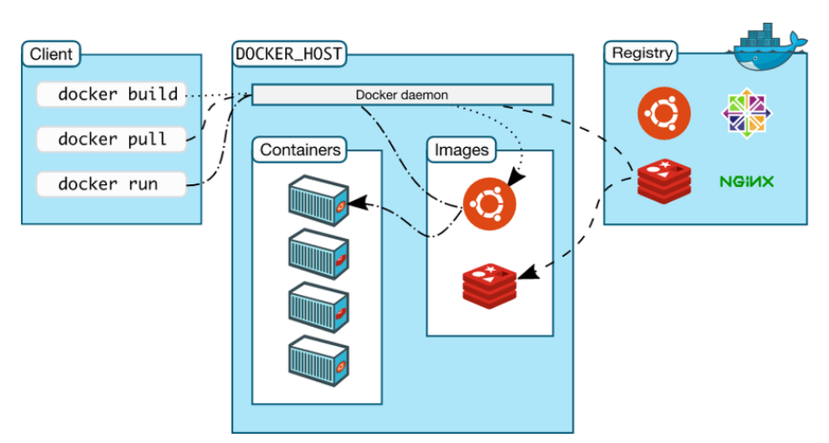
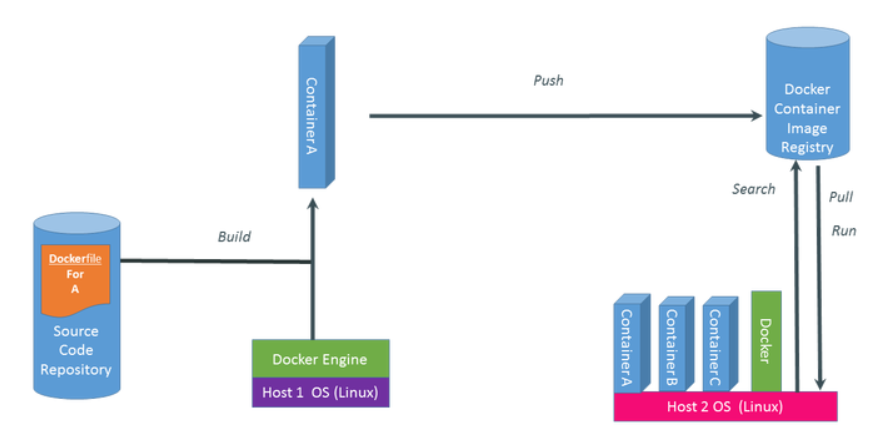

# 1. Docker là gì? 
- Docker là một nền tảng cho developers và sysadmin để develop, deploy và run application với container. Nó cho phép tạo ra các môi trường dộc lập để khởi chạy và phét triển ứng dụng và môi trường này được gọi là container. Khi cần deploy lên bất kỳ server nào chỉ cần run container của Docker thì application của bạn sẽ được khởi chạy ngay lập tức
- Các containers cho phép lập trình viên đóng gói một ứng dụng với tất cả các phần cần thiết, chẳng hạn như thư viện và các phụ thuộc khác, và gói tất cả ra dưới dạng một package.
# 2. Lợi ích của docker
- Thời gian “start” và “stop” cực ngắn
- Có thể run container trên mỗi hệ thống mong muốn 
- Dễ dàng thiét lập môi trường làm việc. Các lập trình viên khi sử dụng Docker chỉ cần config 1 lần. Họ sẽ không cần cài đặt lại Dependencies sau đó nữa. Nếu có sự thay đổi mới về thành viên hay thiết bị, người dùng chỉ cần chia sẻ config mà thôi.
- Nó giữ cho word-space sạch sẽ hơn khi xóa môi trường mà ảnh hưởng đến các phần khác.

# 3. Một số khái niệm  

 

- **Docker Engine** : là thành phần chính của Docker, như một công cụ để đóng gói ứng dụng
- **Docker Daemon**: lắng nghe các yêu cầu từ Docker Client để quản lý các đối tượng như Container, Image, Network và Volumes thông qua REST API. Các Docker Daemon cũng giao tiếp với nhau để quản lý các Docker Service.
- **Docker Client**: là cách mà bạn tương tác với docker thông qua command trong terminal. Docker Client sẽ sử dụng API gửi lệnh tới Docker Daemon
- **Docker Hub** : là một “github for docker images”. Trên DockerHub có hàng ngàn public images được tạo bởi cộng đồng cho phép bạn dễ dàng tìm thấy những image mà bạn cần. Và chỉ cần pull về và sử dụng với một số config mà bạn mong muốn.
- **Images**: là một khuôn mẫu để tạo một container. Thường thì image sẽ dựa trên 1 image có sẵn với những tùy chỉnh thêm. Ví dụ bạn build 1 image dựa trên image Centos mẫu có sẵn để chạy Nginx và những tùy chỉnh, cấu hình để ứng dụng web của bạn có thể chạy được. Bạn có thể tự build một image riêng cho mình hoặc sử dụng những image được chia sẽ từ cộng đồng Docker Hub. Một image sẽ được build dựa trên những chỉ dẫn của Dockerfile.
- **Container**: là một instance của một image. Bạn có thể create, start, stop, move or delete container dựa trên Docker API hoặc Docker CLI.
- **Volumes**: là phần dữ liệu được tạo ra khi container được khởi tạo.
- **Docker Registry**: là nơi lưu trữ riêng của Docker Images. Images được push vào registry và client sẽ pull images từ registry. Có thể sử dụng registry của riêng bạn hoặc registry của nhà cung cấp như : AWS, Google Cloud, Microsoft Azure.
- **Docker Repository**: là tập hợp các Docker Images cùng tên nhưng khác tags
- **Docker Networking**: cho phép kết nối các container lại với nhau. Kết nối này có thể trên 1 host hoặc nhiều host.
- **Docker Compose**: là công cụ cho phép run app với nhiều Docker containers 1 cách dễ dàng hơn. Docker Compose cho phép bạn config các command trong file docker-compose.yml để sử dụng lại. Có sẵn khi cài Docker.
- **Docker Swarm**: để phối hợp triển khai container.
- **Docker Services**: là các containers trong production. 1 service chỉ run 1 image nhưng nó mã hoá cách thức để run image — sử dụng port nào, bao nhiêu bản sao container run để service có hiệu năng cần thiết và ngay lập tức.

# 4. Dockerfile
- Dockerfile là file config cho Docker để build ra image. 
- Nó dùng một image cơ bản để xây dựng lớp image ban đầu. Một số image cơ bản: python, unbutu and alpine. Sau đó nếu có các lớp bổ sung thì nó được xếp chồng lên lớp cơ bản. Cuối cùng một lớp mỏng có thể được xếp chồng lên nhau trên các lớp khác trước đó.
- Các config :

config | ỹ nghĩa
---|---
FROM   |  chỉ định image gốc: python, unbutu, alpine…
LABEL | cung cấp metadata cho image. Có thể sử dụng để add thông tin maintainer. Để xem các label của images, dùng lệnh docker inspect.
ENV | thiết lập một biến môi trường.
RUN | Có thể tạo một lệnh khi build image. Được sử dụng để cài đặt các package vào container.
COPY | Sao chép các file và thư mục vào container.
ADD | Sao chép các file và thư mục vào container.
CMD | Cung cấp một lệnh và đối số cho container thực thi. Các tham số có thể được ghi đè và chỉ có một CMD.
WORKDIR | Thiết lập thư mục đang làm việc cho các chỉ thị khác như: RUN, CMD, ENTRYPOINT, COPY, ADD,…
ARG | Định nghĩa giá trị biến được dùng trong lúc build image.
ENTRYPOINT | cung cấp lệnh và đối số cho một container thực thi.
EXPOSE | khai báo port lắng nghe của image.
VOLUME | tạo một điểm gắn thư mục để truy cập và lưu trữ data.

# 5. Quy trình thực thi của một hệ thống sử dụng Docker

 

- Một hệ thống Docker được thực thi với 3 bước chính :

        Build >> Push >> Pull/Run

- **Build**
   - Đầu tiên tạo một dockerfile, trong dockerfile này chính là code của chúng ta.
   - Dockerfile này sẽ được Build tại một máy tính đã cài đặt Docker Engine.
   - Sau khi build ta sẽ có được Container, trong Container này chứa ứng dụng kèm bộ thư viện của chúng ta.
- **Push**
  - Sau khi có được Container, chúng ta thực hiện push Container này lên cloud và lưu tại đó.
- **Pull/Run**
  - Nếu một máy tính khác muốn sử dụng Container chúng ta thì bắt buộc máy phải thực hiện việc Pull container này về máy, tất nhiên máy này cũng phải cài Docker Engine. Sau đó thực hiện Run Container này.

# Tham khảo

- https://topdev.vn/blog/docker-la-gi/

- https://dev.classmethod.jp/articles/docker-la-gi-tim-hieu-mot-so-dinh-nghia-co-ban-ve-docker/