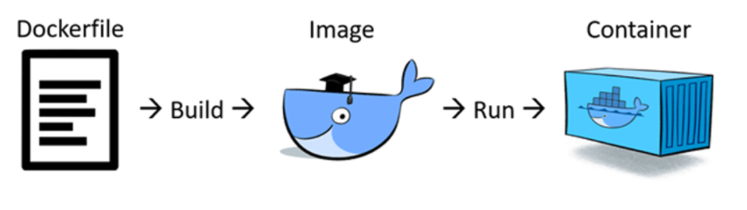

# 1. Dockerfile là gì? 

 

- Dockerfile là một file dạng text không có extension, và tên bắt buộc phải là Dockerfile
- Dockerfile là một file kịch bản sử dụng để tạo mới một image
- Nó dùng một image cơ bản để xây dựng lớp image ban đầu. Một số image cơ bản: python, unbutu and alpine. Sau đó nếu có các lớp bổ sung thì nó được xếp chồng lên lớp cơ bản. Cuối cùng một lớp mỏng có thể được xếp chồng lên nhau trên các lớp khác trước đó.

# 2. Cấu trúc của một Dockerfile
- Đây là cấu trúc một Dockerfile của ứng dụng Wordpress

```
FROM php:7.1-apache

# install the PHP extensions we need
RUN set -ex; \
	\
	savedAptMark="$(apt-mark showmanual)"; \
	\
	apt-get update; \
	apt-get install -y --no-install-recommends \
		libjpeg-dev \
		libpng-dev \
	; \
	\
	docker-php-ext-configure gd --with-png-dir=/usr --with-jpeg-dir=/usr; \
	docker-php-ext-install gd mysqli opcache zip; \
	\
# reset apt-mark's "manual" list so that "purge --auto-remove" will remove all build dependencies
	apt-mark auto '.*' > /dev/null; \
	apt-mark manual $savedAptMark; \
	ldd "$(php -r 'echo ini_get("extension_dir");')"/*.so \
		| awk '/=>/ { print $3 }' \
		| sort -u \
		| xargs -r dpkg-query -S \
		| cut -d: -f1 \
		| sort -u \
		| xargs -rt apt-mark manual; \
	\
	apt-get purge -y --auto-remove -o APT::AutoRemove::RecommendsImportant=false; \
	rm -rf /var/lib/apt/lists/*

# set recommended PHP.ini settings
# see https://secure.php.net/manual/en/opcache.installation.php
RUN { \
		echo 'opcache.memory_consumption=128'; \
		echo 'opcache.interned_strings_buffer=8'; \
		echo 'opcache.max_accelerated_files=4000'; \
		echo 'opcache.revalidate_freq=2'; \
		echo 'opcache.fast_shutdown=1'; \
		echo 'opcache.enable_cli=1'; \
	} > /usr/local/etc/php/conf.d/opcache-recommended.ini

RUN a2enmod rewrite expires

VOLUME /var/www/html

ENV WORDPRESS_VERSION 5.0.3
ENV WORDPRESS_SHA1 f9a4b482288b5be7a71e9f3dc9b5b0c1f881102b

RUN set -ex; \
	curl -o wordpress.tar.gz -fSL "https://wordpress.org/wordpress-${WORDPRESS_VERSION}.tar.gz"; \
	echo "$WORDPRESS_SHA1 *wordpress.tar.gz" | sha1sum -c -; \
# upstream tarballs include ./wordpress/ so this gives us /usr/src/wordpress
	tar -xzf wordpress.tar.gz -C /usr/src/; \
	rm wordpress.tar.gz; \
	chown -R www-data:www-data /usr/src/wordpress

COPY docker-entrypoint.sh /usr/local/bin/

ENTRYPOINT ["docker-entrypoint.sh"]
CMD ["apache2-foreground"]
```
# 3. Các command cơ bản trong Dockerfile

- **FROM** 
  - FROM chỉ định rằng image build này sẽ base trên image gốc nào
  - Ví dụ  
  
        FROM centos:centos7

- **LABEL**
  - LABEL: Chỉ định label metadata của image. Để xem được các label này sử dụng câu lệnh `docker inspect <IMAGE ID>`
  - Ví dụ  
   
        LABEL "image-type"="huy-test"
        LABEL "image-type1"="huy-test1"
        LABEL "image-type2"="huy-test2"


