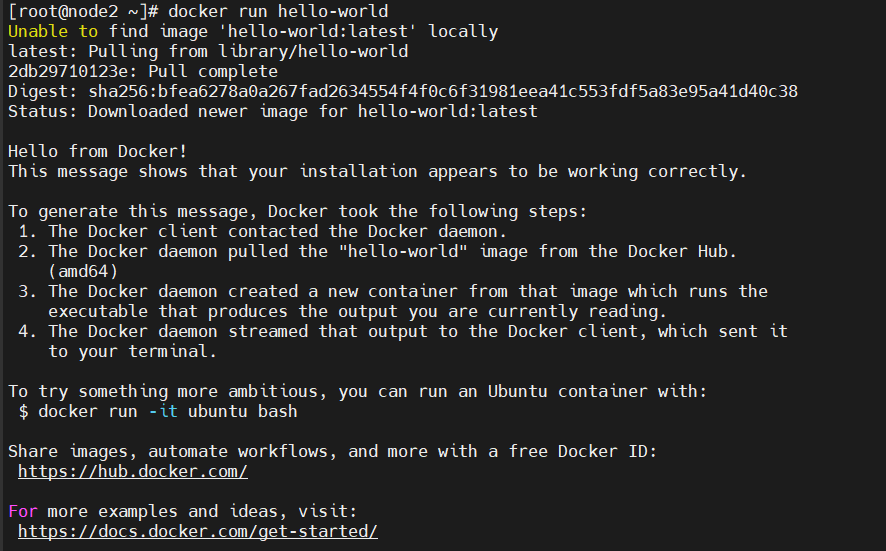

# 1. Các phiên bản Docker#

 Có hai phiên bản chính của Docker là Docker EE, và Docker CE.

- Docker EE (Docker Enterprise Edition)
  - Docker EE có 3 versions chính là Basic, Standard, Advanced. Bản Basic bao gồm Docker platform, hỗ trợ support và certification. Bản Standard và Advanced thêm các tính năng như container management (Docker Datacenter) và Docker Security Scanning.

  - Docker EE được support bởi Alibaba, Canonical, HPE, IBM, Microsoft…

  - Docker cũng cung cấp một certification để giúp các doanh nghiệp đảm bảo các sản phẩm của họ được hoạt động với Docker EE.

- Docker CE (Docker Community Edition)
  - Docker CE, đúng như tên gọi, nó là một phiên bản Docker do cộng đồng support và phát triển, hoàn toàn miễn phí.

  - Có hai phiên bản của Docker CE là Edge và Stable. Bản Edge sẽ được release hàng tháng với các tính năng mới nhất, còn Stable sẽ release theo quý.

- Tóm lại Docker CE là free còn EE thì là trả phí. Cả hai phiên bản Docker CE vào Docker EE tuy hướng vào các đối tượng khác nhau nhưng chúng không có quá nhiều sự khác biệt. Cả hai đều dựa vào Docker open source được phát triển bởi cả cộng đồng và các đối tác của Docker.

# 2. Cài đặt docker trên centos 8 
## 2.1 Chuẩn bị 

- Hệ điều hành centos 8

OS | Interface | hardware | disk 
---|---|---|---
Centos 8 | enp1s0: 192.168.70.52 | 2 CPU - 2GB RAM	| 30GB

## 2.2 Cài đặt Docker sử dụng yum và repository

- Cài đặt các gói cần thiết
 
      yum install -y yum-utils device-mapper-persistent-data lvm2

- Thêm Docker repo

      yum-config-manager --add-repo https://download.docker.com/linux/centos/docker-ce.repo

- Cài đặt bản lastest của Docker CE  

      yum install -y docker-ce docker-ce-cli containerd.io

- Kiểm tra lại cài đặt
  
      systemctl start docker
      docker -v
      Docker version 20.10.14, build a224086
- Chạy container đầu tiên với Docker

      docker run hello-world

  - Bản chất của câu lệnh trên, Docker sẽ pull một image là hello-world trên Docker hub về server và chạy container với image đó.    

 


## 2.2 Cài đặt docker thông qua ansible

- Tạo file playbook.yml chứa nội dung sau 

```
- name: install request
  yum:
    name:
      - yum-utils
      - device-mapper-persistent-data
      - lvm2
    state: latest
    update_cache: yes
- name: Add Docker repo
  get_url:
        url: https://download.docker.com/linux/centos/docker-ce.repo
        dest: /etc/yum.repos.d/docker-ce.repo
  become: yes

- name: Enable Docker Edge repo
  ini_file:
        dest: /etc/yum.repos.d/docker-ce.repo
        section: 'docker-ce-edge'
        option: enabled
        value: 0
  become: yes

- name: Enable Docker Test repo
  ini_file:
        dest: /etc/yum.repos.d/docker-ce.repo
        section: 'docker-ce-test'
        option: enabled
        value: 0
  become: yes
- name: install docker
  yum:
    name:
      - docker-ce
      - docker-ce-cli
      - containerd.io
    state: latest
    update_cache: yes
- name: start & enble docker
  service:
    name: docker
    state: started
    enabled: yes
